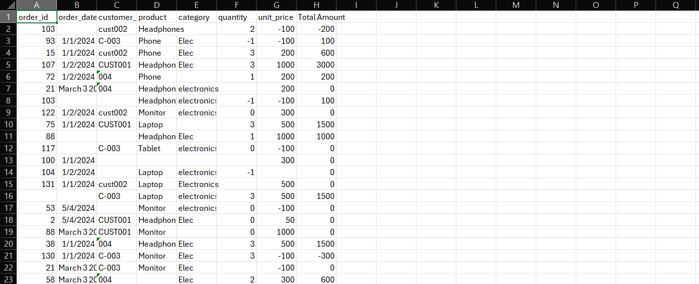
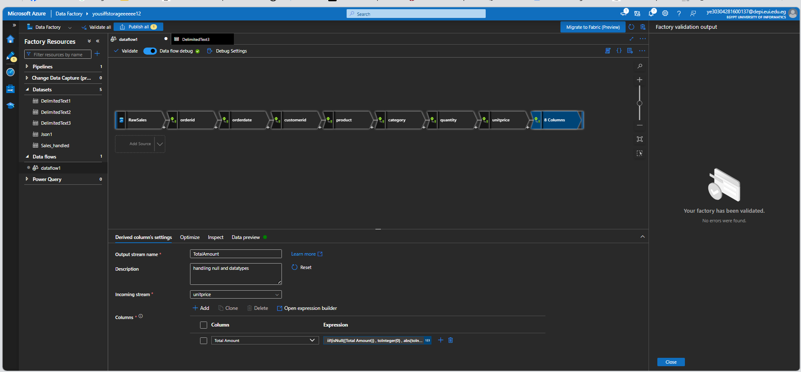
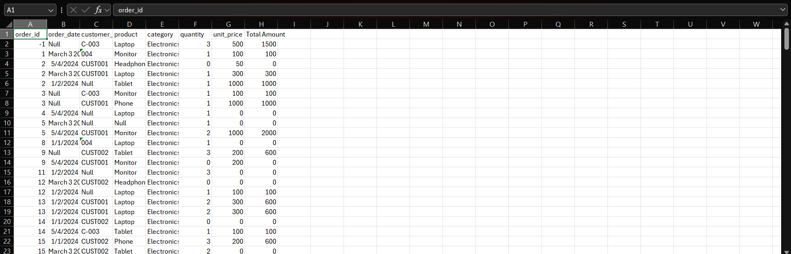
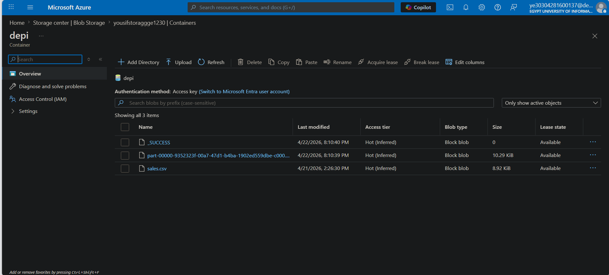

# Azure Data Factory ETL Pipeline – Sales Data Cleaning

## 📖 Overview
This project implements an ETL pipeline using Azure Data Factory to process raw sales data stored in Azure Blob Storage.

The pipeline performs data cleaning and transformation using Data Flows, including:
- Handling missing values
- Standardizing text fields
- Converting data types
- Fixing negative values
- Sorting based on order_id

---

## 🏗️ Architecture

1. Azure Resource Group
2. Azure Storage Account
3. Blob Container (stores input/output CSV files)
4. Azure Data Factory
5. Data Flow (for transformations)
6. Sink (writes cleaned data back to storage)

---

## ⚙️ Data Processing Steps

### 🔹 Source
- Input file: `sales.csv`
- Stored in Azure Blob Storage

---

### 🔹 Transformations (Derived Columns)

| Column        | Transformation |
|--------------|---------------|
| order_id     | `iif(isNull(order_id), -1, toInteger(order_id))` |
| order_date   | `iif(isNull(order_date), 'Null', order_date)` |
| customer_id  | `iif(isNull(customer_id), 'Null', upper(customer_id))` |
| product      | `iif(isNull(product), 'Null', product)` |
| category     | `iif(isNull(category), 'Electronics', 'Electronics')` |
| quantity     | `iif(isNull(quantity), 0, abs(toInteger(quantity)))` |
| unit_price   | `iif(isNull(unit_price), 0, abs(toInteger(unit_price)))` |
| Total Amount | `iif(isNull({Total Amount}), 0, abs(toInteger({Total Amount})))` |

---

### 🔹 Sort 
- sort data based on `order_id`

### 🔹 Sink
- Cleaned data is written back to Azure Blob Storage container

---

## 📸 Screenshots

### 🟢 Input Data

### 🟢 Data Flow

### 🟢 Output Data

### 🟢 Container

## ✅ Results
- Null values handled
- Negative values converted to positive
- Text standardized
- Clean dataset generated

---

## 📌 Notes
- Ensure correct column mapping in Data Flow
- Use Debug mode before publishing
- Verify data types in sink

---

